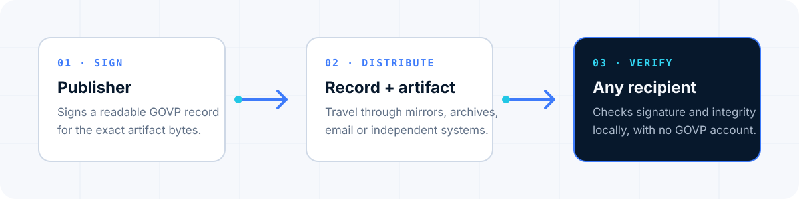
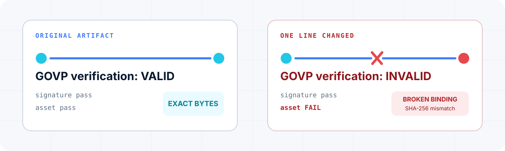

<p align="center">
  <picture>
    <source media="(prefers-color-scheme: dark)" srcset="brand/govp-wordmark-dark.svg">
    <source media="(prefers-color-scheme: light)" srcset="brand/govp-wordmark-light.svg">
    
  </picture>
</p>

<p align="center"><strong>Open protocol stewarded by Gemacode.</strong></p>

GOVP is an open protocol for making files and digital artifacts independently
verifiable without an account, a central API or a proprietary verifier.

A publisher places a small Ed25519-signed GOVP record next to a document,
dataset, model or build artifact. A recipient can then verify the record and
the exact artifact bytes locally with any conforming implementation.

[Documentation](https://govp.io/govp/docs.html) ·
[GOVP-1 specification](spec/GOVP-1.txt) ·
[Browser verifier](https://govp.io/govp/verify.html) ·
[Conformance vectors](conformance/vectors.json) ·
[Security](SECURITY.md)

<p align="center">
  
</p>

## Why GOVP exists

Digital artifacts leave the systems that created them. They are downloaded,
mirrored, emailed, archived and consumed by software that cannot safely depend
on the original publisher remaining online.

- A checksum detects changed bytes, but does not carry a signature.
- A raw signature does not define a shared record format, canonical signing
  input, identifier or interoperability test suite.
- A hosted verification API works only while its service, account and trust
  boundary remain available.

GOVP standardizes that missing layer: a readable signed record, deterministic
verification rules, content-derived identifiers, JSON Schema and byte-exact
conformance vectors. GOVP is a protocol and testable contract, not a hosted
trust service.

## A GOVP record is readable text

This complete record is a synthetic fixture from [`examples/`](examples/):

```text
# GOVP public verification record
# Synthetic fixture: reserved example domain, no production or customer data
# Verify locally with the bundled manufacturing-record.statement.txt asset
Version: GOVP-1
Canonical: https://manufacturer.example/.well-known/govp.txt
Publisher: Example Manufacturing Organization
Asset-Type: document
Asset-ID: SAMPLE-LOT-0001
Asset-SHA256: 2e6870bced11f1ddf51a5ce5514244b9e670c553560915b6c13ea6b49263a2d0
Profile: industrial-manufacturing
Generated-At: 2026-08-04T12:00:00Z
GOVP-ID: GOVP-DOC-cb352d4b8a77
Evidence: https://manufacturer.example/evidence/sample-manufacturing-record.txt
Public-Key: IXxXtLEM5a0OxZqhFTv3Z6yR/zV/pZ2yFx2VGGyr34g=
Signature: YM9VhQ7d/Wihmn8z4sA8WxT7Gz9pejxAU5DdnG51cnJVwxEhDkPhH5nZzXudPzja/nfGqoTrstDpxSy6k1kqDw==
```

Comments are unsigned. GOVP signs the normalized field lines, including
unknown extension fields, so implementations cannot silently reinterpret or
discard signed data.

## Verify it in 60 seconds

Python 3.10 or newer is required for the reference implementation.

```bash
git clone https://github.com/govp-protocol/govp.git
cd govp
python -m pip install .
govp verify examples/manufacturing-record.govp.txt \
  --asset examples/manufacturing-record.statement.txt
```

Expected result:

```text
GOVP verification: VALID
  format       pass
  signature    pass
  govp-id      pass
  canonical    not checked
  asset        pass
  record       GOVP-DOC-cb352d4b8a77
```

Verification is local. Neither the record nor the artifact is uploaded to
GOVP. `canonical` is not checked in this example because the record was loaded
from disk rather than fetched from its signed HTTPS location.

## Break the artifact, break the binding

The repository also includes a synthetic copy with one changed line. It uses
the same signed GOVP record, so the record signature still passes, but the
modified artifact bytes no longer match the signed SHA-256 digest.

<p align="center">
  
</p>

```bash
govp verify examples/manufacturing-record.govp.txt \
  --asset examples/manufacturing-record.tampered.statement.txt
```

Expected rejection:

```text
GOVP verification: INVALID
  format       pass
  signature    pass
  govp-id      pass
  canonical    not checked
  asset        FAIL
  record       GOVP-DOC-cb352d4b8a77
```

This failure does not mean the signed record was forged. It means the supplied
artifact is not the exact artifact described by that record. The command exits
with status `1`, making the same check usable in local workflows and CI.

For machine-readable output, add `--json`. Exit code `0` means verification
succeeded, `1` means the record was evaluated and is not valid, and `2` means
the command or input could not be processed.

## Integrate the verifier

```python
from pathlib import Path

from govp.core import load_record, verify

record = load_record(Path("record.govp.txt"))
asset = Path("artifact.bin").read_bytes()
result = verify(record, asset_bytes=asset)

if not result.ok:
    raise ValueError(result.checks)

print(result.derived_govp_id)
```

The Python package is a reference implementation, not a network service.
Applications remain responsible for authorization, download limits,
persistence, display escaping and their own trust policy. See the
[integration guide](docs/integration.md) for the complete result contract.

## What GOVP proves — and what it does not

| A valid result establishes | A valid result does not establish |
|---|---|
| The GOVP record has a valid signature from its included public key | The legal identity or authority behind that key |
| The GOVP-ID matches the declared artifact identity | That a signed statement is factually true |
| Supplied artifact bytes match the signed SHA-256 digest | Independent existence time or timestamp anchoring |
| A remotely fetched record ended at its signed canonical HTTPS URL | Revocation, current authorization or continued availability |

GOVP deliberately separates cryptographic verification from identity,
certification and business-policy decisions. Deployments can add PKI,
registries, transparency logs, witnesses or timestamp authorities where those
properties are required.

## Where GOVP fits

GOVP is intentionally narrower than several established technologies:

- **W3C Verifiable Credentials** model claims issued about subjects and their
  presentation between issuers, holders and verifiers.
- **C2PA Content Credentials** capture rich provenance and history for digital
  content through manifests, assertions and content bindings.
- **Sigstore** secures software supply chains with identity-bound signing,
  short-lived certificates and transparency logs.
- **GOVP** binds a small, portable signed record to exact artifact bytes with
  deterministic, service-independent verification.

They solve different trust problems and can be complementary. Read
[How GOVP fits](docs/comparison.md) for a neutral selection guide and links to
the specifications of each project.

## Use cases

| Artifact | Example |
|---|---|
| Document | Bind a published declaration, policy or report to its exact bytes |
| Dataset | Identify the frozen snapshot used for analysis or evaluation |
| Model | Attach a portable signed record to model artifacts or model cards |
| Build output | Verify a release after download, mirroring or archival |
| Benchmark | Bind a declared result to the exact published result set |
| Operational record | Carry a signed declaration outside its originating system |

Use GOVP when recipients need a durable answer to: “Does this artifact match
the signed record I received?” Add other systems when they must also answer:
“Who is legally responsible?”, “When was this independently witnessed?” or
“Is this claim acceptable under my policy?”.

## Implementations

The wire protocol is language-neutral. Conformance is determined by the
normative text and published vectors, not by matching Python internals.

| Language/runtime | Project | Status |
|---|---|---|
| Python 3.10+ | [`govp`](src/govp/) | Reference verifier · 0.1.8 |
| Browser JavaScript | [`govp.io`](https://github.com/govp-protocol/govp.io) | Independent verification engine · GOVP-1 |
| Go | [Start an implementation](https://github.com/govp-protocol/govp/issues/new?template=implementation.yml) | Wanted |
| Rust | [Start an implementation](https://github.com/govp-protocol/govp/issues/new?template=implementation.yml) | Wanted |
| Other | [Read the conformance guide](docs/conformance.md) | Welcome |

An implementation should consume the byte-exact vectors, report every core
check and stop on specification ambiguity rather than choosing undocumented
behavior.

## Stability and provenance

**GOVP-1 is frozen. Low protocol churn is a compatibility guarantee by
design.** Changes to signing inputs or wire behavior require explicit
versioning, new conformance vectors and migration analysis.

The current reference verifier is **0.1.8**. The audited publication baseline
is commit
[`c25516f471ed38f4b28a23b8eaa9af490a8f7f8b`](https://github.com/govp-protocol/govp/commit/c25516f471ed38f4b28a23b8eaa9af490a8f7f8b).
Download the
[`v0.1.8` immutable release](https://github.com/govp-protocol/govp/releases/tag/v0.1.8)
or verify its GitHub release attestation:

```bash
gh release verify v0.1.8 --repo govp-protocol/govp
```

The public [provenance manifest](https://govp.io/PROTOCOL-SOURCE.json) records
that commit, its Git tree, the reviewed source-archive hash and the exact
hashes of every normative artifact. Documentation-only commits on `main` do
not redefine the GOVP-1 wire format.

## Repository map

- `spec/` — normative and concise protocol text
- `schema/` — machine-readable record and bundle schema
- `conformance/` — byte-exact text and JSON vectors
- `src/govp/` — Python reference verifier and CLI
- `examples/` — valid signed records with fully synthetic content
- `tests/` — protocol, transport and CLI regression tests
- `docs/` — adoption, integration, security and release guidance
- `brand/` — canonical editable GOVP visual identity and usage rules
- `tools/` — repository integrity checks for non-normative publication assets

## Contribute

GOVP especially welcomes independent implementations, conformance reports,
synthetic vectors, integration guides and ambiguity reports found while
implementing the specification.

[Contributing guide](CONTRIBUTING.md) ·
[Report a specification ambiguity](https://github.com/govp-protocol/govp/issues/new?template=spec-ambiguity.yml) ·
[Propose an implementation](https://github.com/govp-protocol/govp/issues/new?template=implementation.yml) ·
[Governance](GOVERNANCE.md) ·
[Support](SUPPORT.md)

## License, scope and stewardship

The specification, conformance material, software and repository documentation
are licensed under Apache License 2.0. Copyright is held by Brilyetz Holding
S.L.; Gemacode is its brand. The visual identity files in `brand/` are
separately governed by their usage rules. Apache-2.0 does not grant rights to
the GOVP or Gemacode names or marks—see [TRADEMARKS.md](TRADEMARKS.md).

The repository is protocol-only. Issuing products, control panels, customer
systems, private keys and commercial extensions are excluded by
[`SCOPE.md`](SCOPE.md) and are not required for GOVP-1 conformance.
